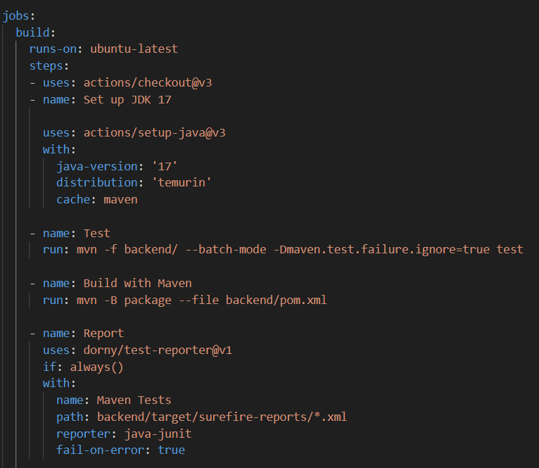

GitHUB Actions:

Im Ordner mit der Name 'workflows' im '.github' Ordner ein .yaml Datei anlegen
Nach jedem push oder pull wird der Action ausgelöst:

Dann als job den Build anlegen mit den Testsd:

Nach dem push (oder pull) kann man auf GitHub unter 'Actions' sehen wie die Test gelaufen sind:

