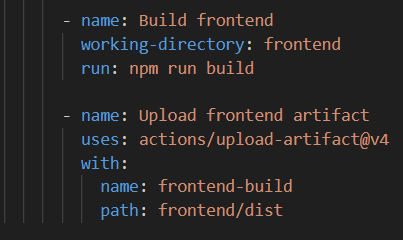
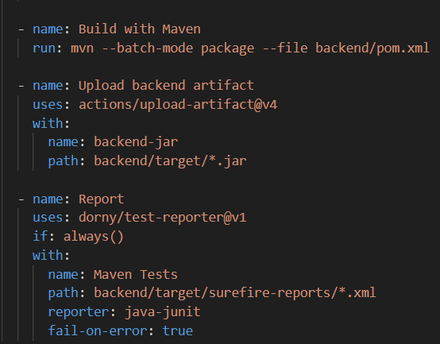

App.test.jsx im src Ordner als test-Datei anlegen.

setupTests.js auch im src Ordner mit *import '@testing-library/jest-dom'*;

In .github/workflows eine yml Datei mit 

(Frontend)

(Backend)

Frontend test laufen lassen mit npm run test -- --test
