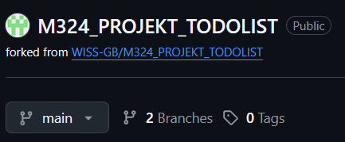
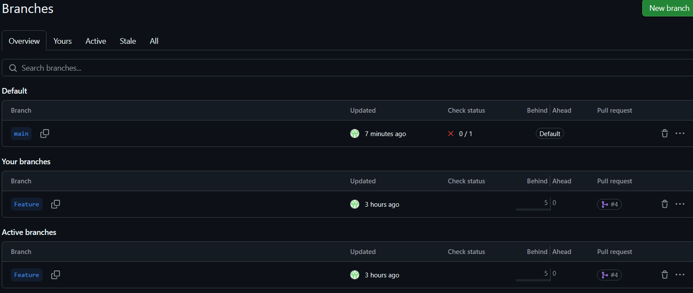
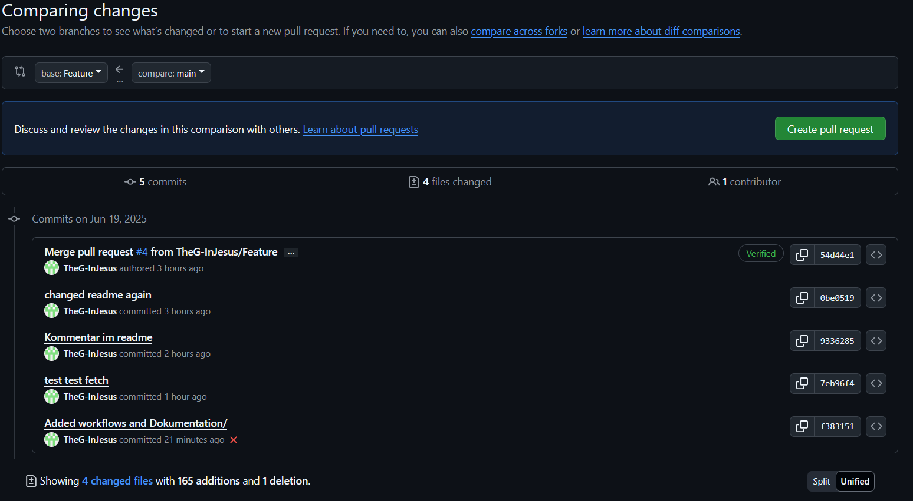

Um ein neues Branch zu kreiieren benutzt man *git branch --name of Branch--*.
Um zu wechseln *git checkout --name of Branch--*
Zuerst eine erstellen und danach darauf wechseln benutzt man das "-b" Flag  nach 'checkout'

Somit hat man das aktuelle Stand vom Projekt auf dem Ordner, aber die Änderungen die man vornimmt
zuerst benehmigt werden müssen, bevor sie ins Main Projekt übernommen werden.

Auf dem GUI sieht es anders aus

Bevor man Änderungen auf den Main Branch übernehmen kann, müssen sie Commited werden. Der Merge
sollte am Besten vom Main-Branch gemacht werden. -> git merge *--name of Branch--*

Danach muss man diese Änderungen nur noch pushen und dann können die Arbeitskollegen die neusten Änderungen 
pullen.

Möchte man vom Branch aus mergen müsste man einen Pull Request machen
